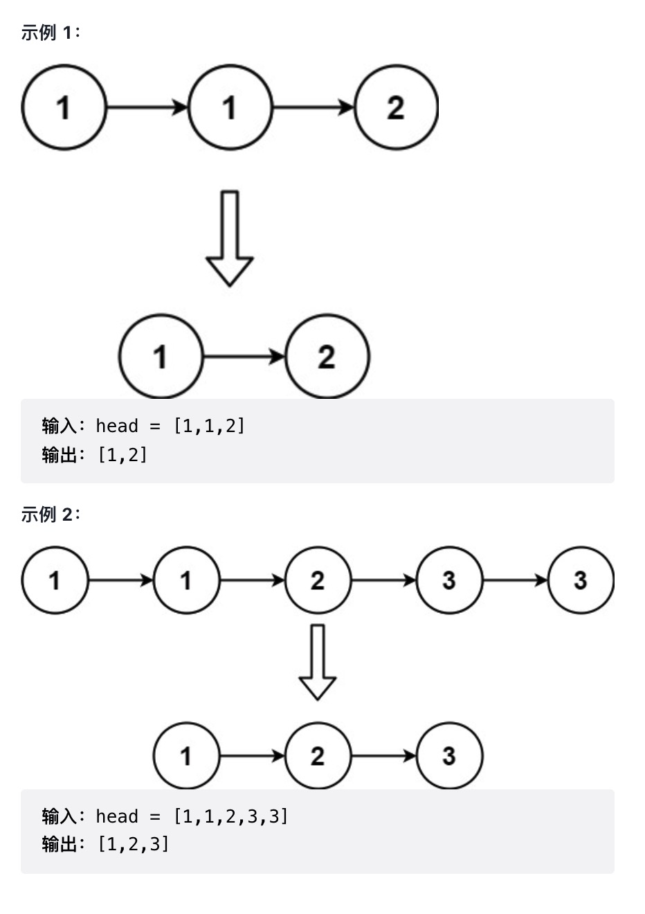

# 删除排序链表中的重复元素

存在一个按升序排列的链表，给你这个链表的头节点 head ，请你删除所有重复的元素，使每个元素 **只出现一次**。

返回同样按升序排列的结果链表。

来源：力扣（LeetCode）
链接：https://leetcode-cn.com/problems/remove-duplicates-from-sorted-list/
著作权归领扣网络所有。商业转载请联系官方授权，非商业转载请注明出处。

思路:

1. 两种特殊情况
2. 当当前 `val === next.val` 时, 跳过 `next`
