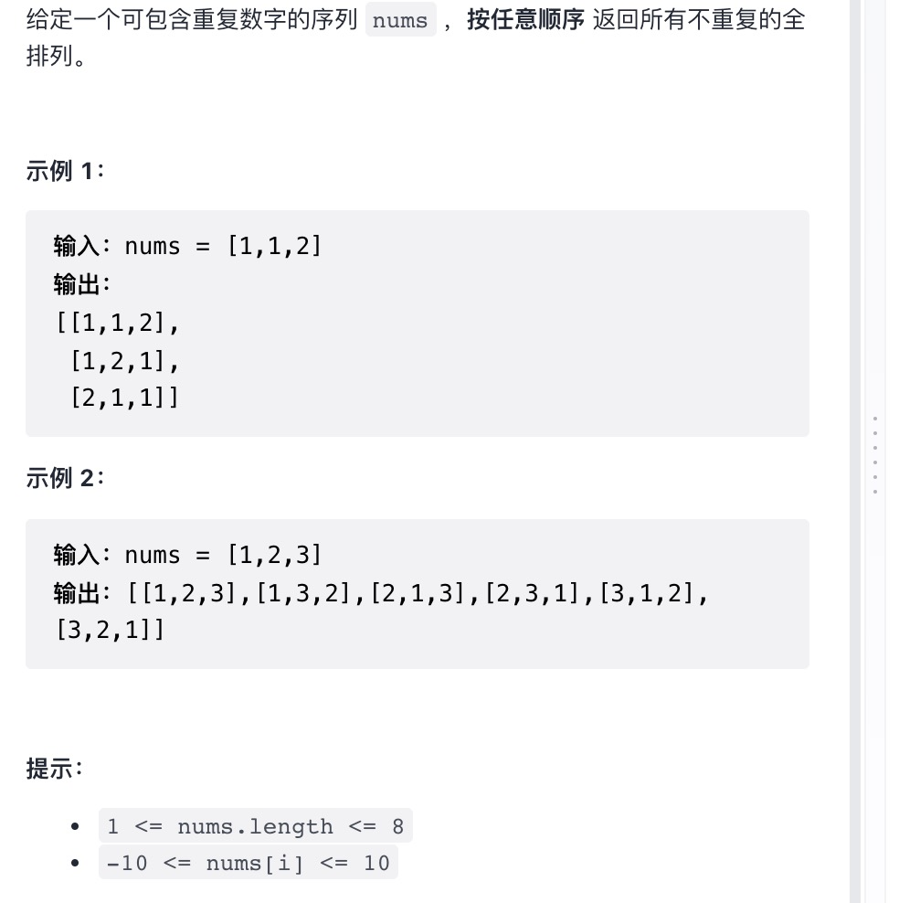

给定一个可包含重复数字的序列 nums ，按任意顺序 返回所有不重复的全排列。

提示：

`1 <= nums.length <= 8`

`-10 <= nums[i] <= 10`

来源：力扣（LeetCode）
链接：<https://leetcode-cn.com/problems/permutations-ii/>
著作权归领扣网络所有。商业转载请联系官方授权，非商业转载请注明出处。

