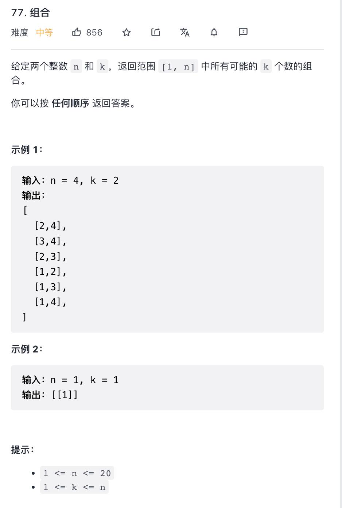

给定两个整数 n 和 k，返回范围 [1, n] 中所有可能的 k 个数的组合。

提示：

`1 <= n <= 20`

`1 <= k <= n`

来源：力扣（LeetCode）
链接：<https://leetcode-cn.com/problems/combinations/>
著作权归领扣网络所有。商业转载请联系官方授权，非商业转载请注明出处。

大致思路:

递归结束条件: 当结果数组的长度等于 `k` 时

数组类值的范围: `min`: 1, `max`: n
