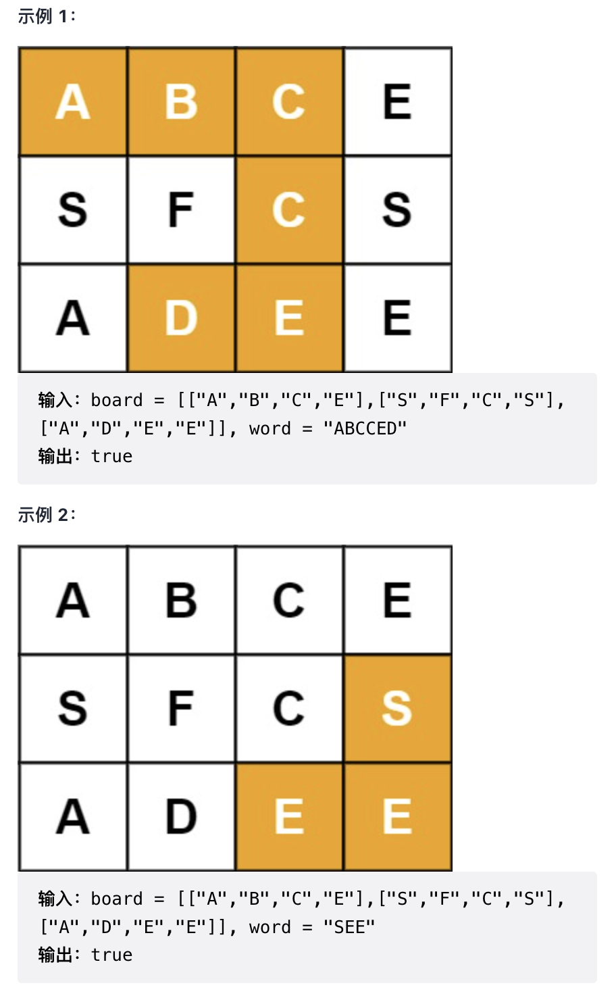

给定一个 m x n 二维字符网格 board 和一个字符串单词 word 。如果 word 存在于网格中，返回 true ；否则，返回 false 。

单词必须按照字母顺序，通过相邻的单元格内的字母构成，其中“相邻”单元格是那些水平相邻或垂直相邻的单元格。同一个单元格内的字母不允许被重复使用。

来源：力扣（LeetCode）
链接：<https://leetcode-cn.com/problems/word-search>
著作权归领扣网络所有。商业转载请联系官方授权，非商业转载请注明出处。

提示：

`m == board.length`

`n = board[i].length`

`1 <= m, n <= 6`

`1 <= word.length <= 15`

`board 和 word 仅由大小写英文字母组成`

