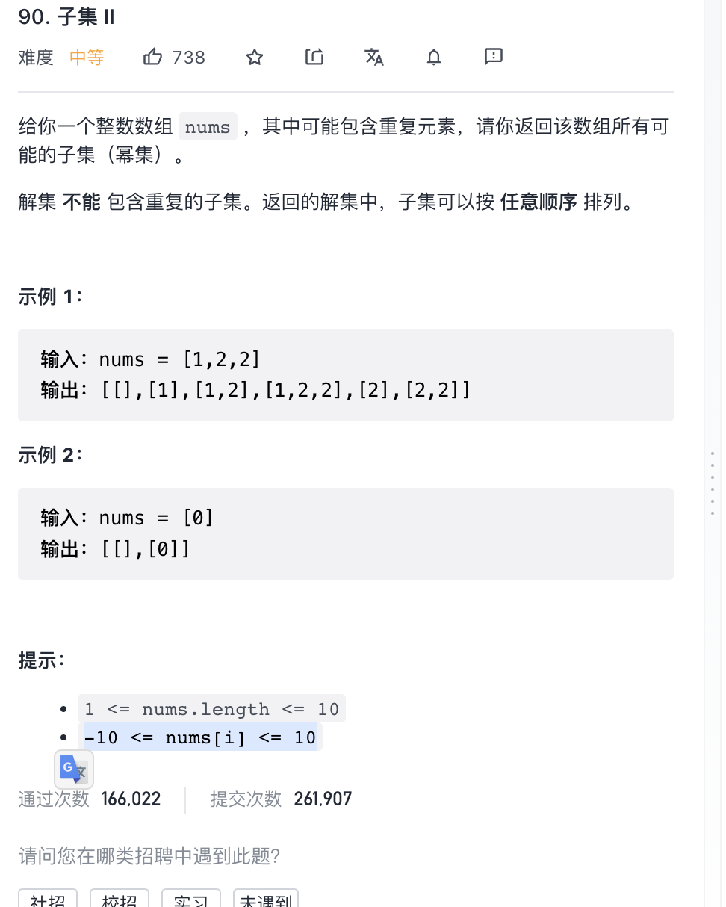

给你一个整数数组 nums ，其中可能包含重复元素，请你返回该数组所有可能的子集（幂集）。

解集 不能 包含重复的子集。返回的解集中，子集可以按 任意顺序 排列。

提示：

`1 <= nums.length <= 10`

`-10 <= nums[i] <= 10`

来源：力扣（LeetCode）
链接：<https://leetcode-cn.com/problems/subsets-ii>
著作权归领扣网络所有。商业转载请联系官方授权，非商业转载请注明出处。

经验: 去重复项  === 排序数组 + 跳过上一个与当前相同的情况(不同情况下的起始情况不同)
