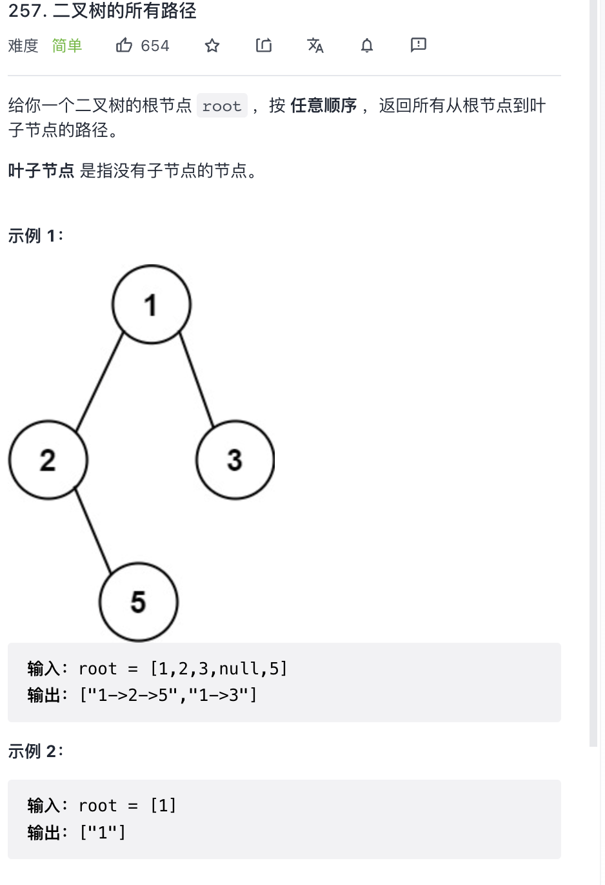

给你一个二叉树的根节点 root ，按 任意顺序 ，返回所有从根节点到叶子节点的路径。

叶子节点 是指没有子节点的节点。

提示：

树中节点的数目在范围 `[1, 100]` 内

`-100 <= Node.val <= 100`

来源：力扣（LeetCode）
链接：<https://leetcode-cn.com/problems/binary-tree-paths>
著作权归领扣网络所有。商业转载请联系官方授权，非商业转载请注明出处。

