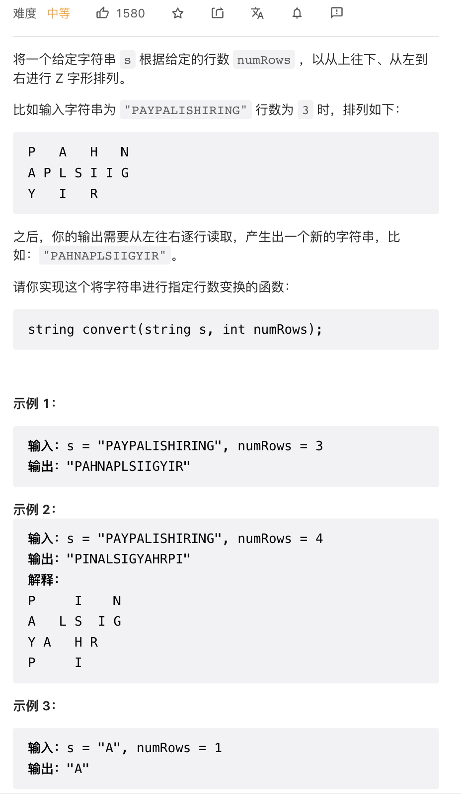

将一个给定字符串 s 根据给定的行数 numRows ，以从上往下、从左到右进行 Z 字形排列。

来源：力扣（LeetCode）
链接：<https://leetcode-cn.com/problems/zigzag-conversion>
著作权归领扣网络所有。商业转载请联系官方授权，非商业转载请注明出处。

提示：

`1 <= s.length <= 1000`

`s` 由英文字母（小写和大写）、`','` 和 `'.'` 组成

`1 <= numRows <= 1000`

