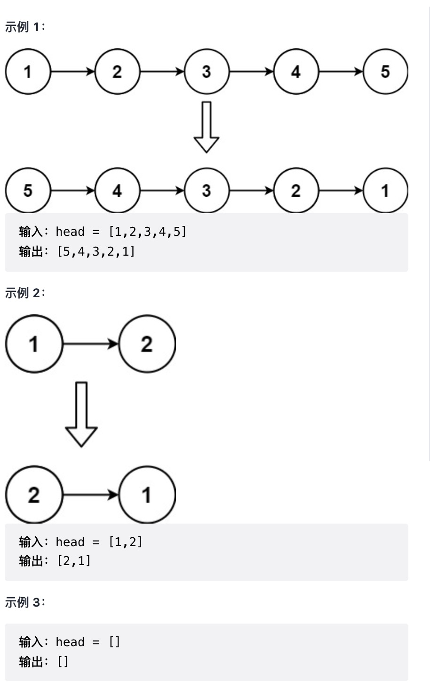

# 反转链表

定义一个函数，输入一个链表的头节点，反转该链表并输出反转后链表的头节点。

来源：力扣（LeetCode）
链接：<https://leetcode-cn.com/problems/reverse-linked-list>
著作权归领扣网络所有。商业转载请联系官方授权，非商业转载请注明出处。

常规思路: 定义当前节点和当前节点的上一个节点, 然后进行交换, 交换过程为:

1. 将当前节点的 `next` 指向上一个节点
2. 将当前节点赋值给前一个节点(即前一节点往后移一步)
3. 将当前节点的 `next` (未修改前的值)赋值给当前节点(即当前节点往后移一步)

递归思路:

注意点: 结束条件以及两种边界情况
