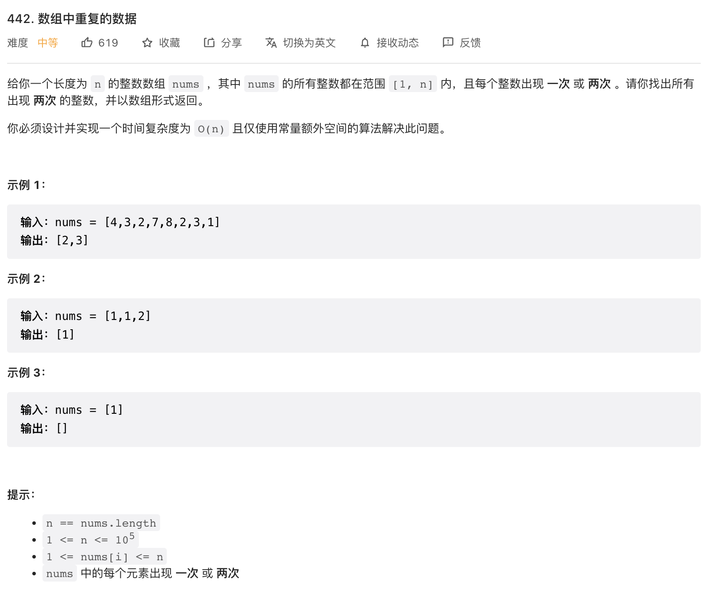

给你一个长度为 n 的整数数组 nums ，其中 nums 的所有整数都在范围 [1, n] 内，且每个整数出现 一次 或 两次 。请你找出所有出现 两次 的整数，并以数组形式返回。

你必须设计并实现一个时间复杂度为 O(n) 且仅使用常量额外空间的算法解决此问题。

来源：力扣（LeetCode）
链接：<https://leetcode.cn/problems/find-all-duplicates-in-an-array>
著作权归领扣网络所有。商业转载请联系官方授权，非商业转载请注明出处。

