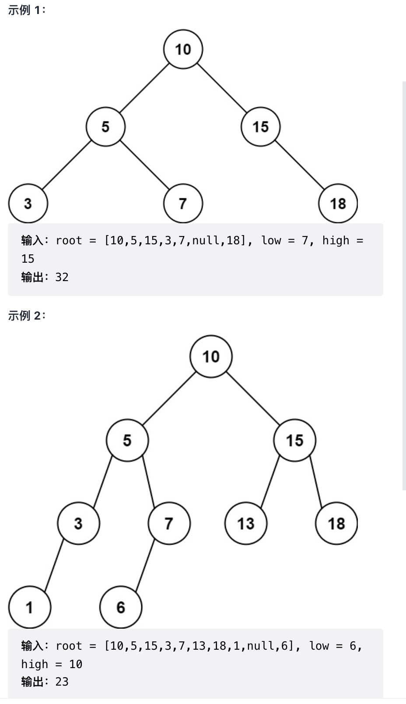

# 二叉搜索树的范围和

给定二叉搜索树的根结点 root，返回值位于范围 [low, high] 之间的所有结点的值的和。

树中节点数目在范围 `[1, 2 * 104]` 内

`1 <= Node.val <= 105`

`1 <= low <= high <= 105`

所有 `Node.val` 互不相同

来源：力扣（LeetCode）
链接：<https://leetcode-cn.com/problems/range-sum-of-bst>
著作权归领扣网络所有。商业转载请联系官方授权，非商业转载请注明出处。

