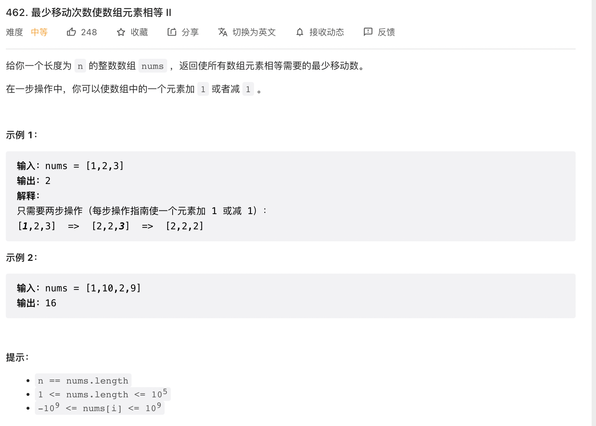

给你一个长度为 n 的整数数组 nums ，返回使所有数组元素相等需要的最少移动数。

在一步操作中，你可以使数组中的一个元素加 1 或者减 1 。

来源：力扣（LeetCode）
链接：<https://leetcode.cn/problems/minimum-moves-to-equal-array-elements-ii/>
著作权归领扣网络所有。商业转载请联系官方授权，非商业转载请注明出处。

