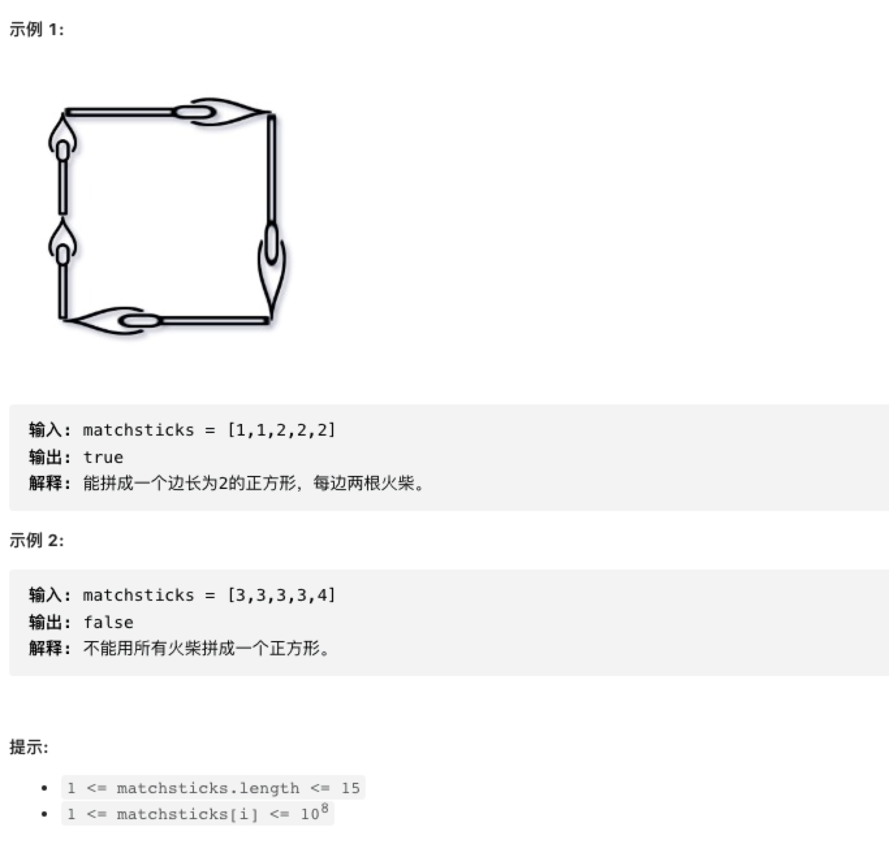

你将得到一个整数数组 matchsticks ，其中 matchsticks[i] 是第 i 个火柴棒的长度。你要用 所有的火柴棍 拼成一个正方形。你 不能折断 任何一根火柴棒，但你可以把它们连在一起，而且每根火柴棒必须 使用一次 。

如果你能使这个正方形，则返回 true ，否则返回 false 。

来源：力扣（LeetCode）
链接：<https://leetcode.cn/problems/matchsticks-to-square>
著作权归领扣网络所有。商业转载请联系官方授权，非商业转载请注明出处。

