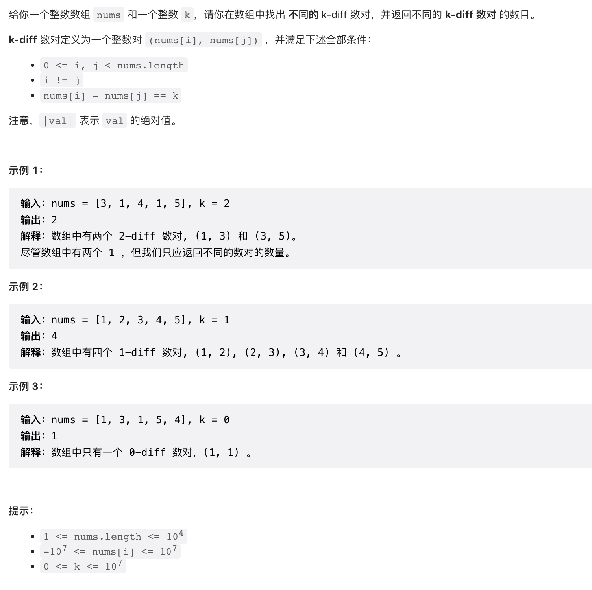

给你一个整数数组 nums 和一个整数 k，请你在数组中找出 不同的 k-diff 数对，并返回不同的 k-diff 数对 的数目。

k-diff 数对定义为一个整数对 (nums[i], nums[j]) ，并满足下述全部条件：

0 <= i, j < nums.length
i != j
nums[i] - nums[j] == k
注意，|val| 表示 val 的绝对值。

来源：力扣（LeetCode）
链接：<https://leetcode.cn/problems/k-diff-pairs-in-an-array>
著作权归领扣网络所有。商业转载请联系官方授权，非商业转载请注明出处。

