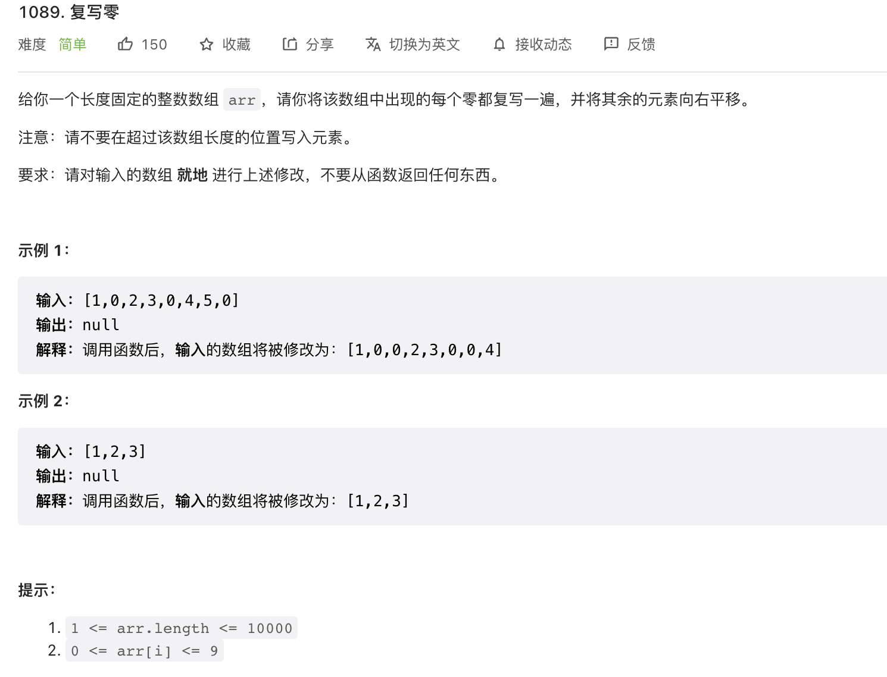

给你一个长度固定的整数数组 arr，请你将该数组中出现的每个零都复写一遍，并将其余的元素向右平移。

注意：请不要在超过该数组长度的位置写入元素。

要求：请对输入的数组 就地 进行上述修改，不要从函数返回任何东西。

来源：力扣（LeetCode）
链接：<https://leetcode.cn/problems/duplicate-zeros>
著作权归领扣网络所有。商业转载请联系官方授权，非商业转载请注明出处。

