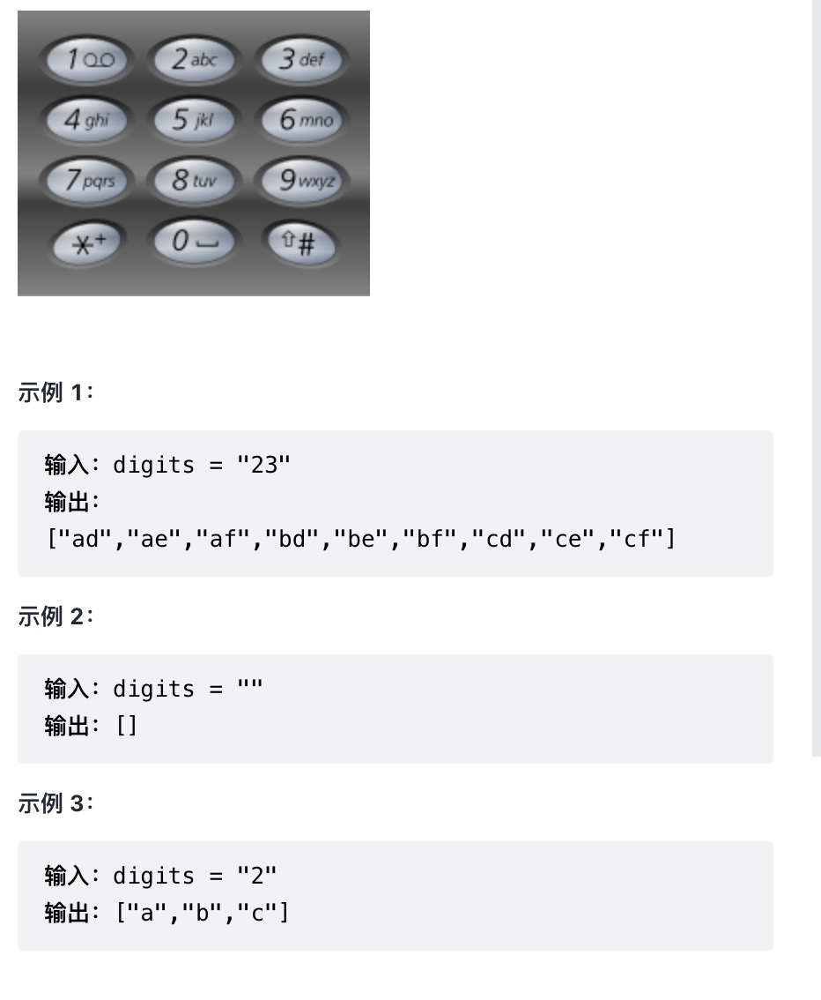

给定一个仅包含数字 2-9 的字符串，返回所有它能表示的字母组合。答案可以按 任意顺序 返回。

给出数字到字母的映射如下（与电话按键相同）。注意 1 不对应任何字母。

来源：力扣（LeetCode）
链接：<https://leetcode-cn.com/problems/letter-combinations-of-a-phone-number/>
著作权归领扣网络所有。商业转载请联系官方授权，非商业转载请注明出处。

回溯:
数字对应字母的全排列组合
