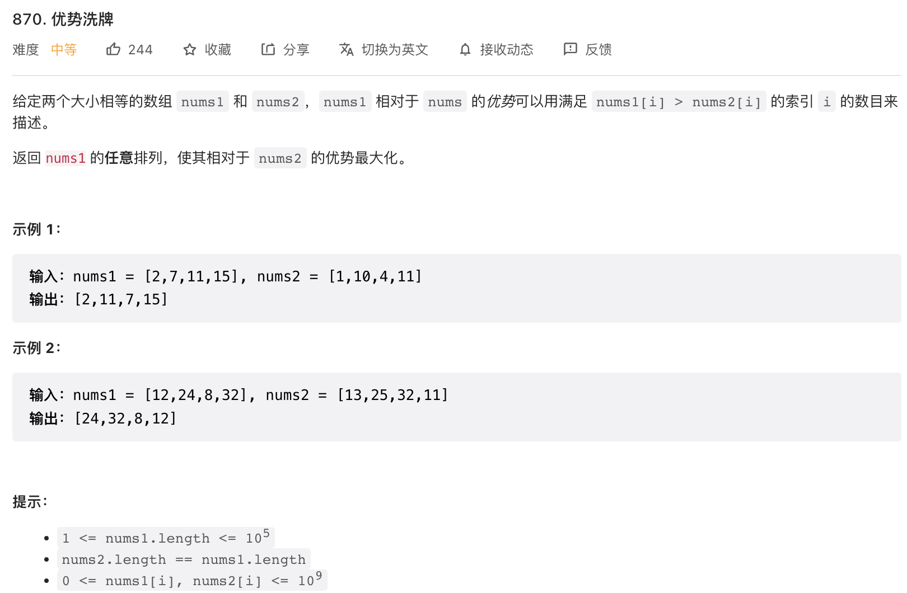

给定两个大小相等的数组 nums1 和 nums2，nums1 相对于 nums 的优势可以用满足 nums1[i] > nums2[i] 的索引 i 的数目来描述。

返回 nums1 的任意排列，使其相对于 nums2 的优势最大化。

来源：力扣（LeetCode）
链接：<https://leetcode.cn/problems/advantage-shuffle>
著作权归领扣网络所有。商业转载请联系官方授权，非商业转载请注明出处。

思路: 对 nums1 进行递增排序, 遍历 nums2, 寻找 nums1 中是否存在大于当前项的值, 若存在, 取该值, 不存在则取 nums1 中的最小值.
