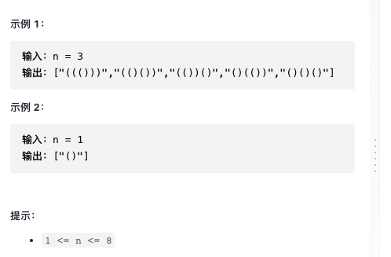

数字 n 代表生成括号的对数，请你设计一个函数，用于能够生成所有可能的并且 有效的 括号组合。

来源：力扣（LeetCode）
链接：<<https://leetcode-cn.com/problems/generate-parentheses/>
著作权归领扣网络所有。商业转载请联系官方授权，非商业转载请注明出处。

有效括号规则: 在拼接的过程中剩余的左侧括号可以小于右侧括号, 但是剩余的右侧括号不能小于左侧括号
