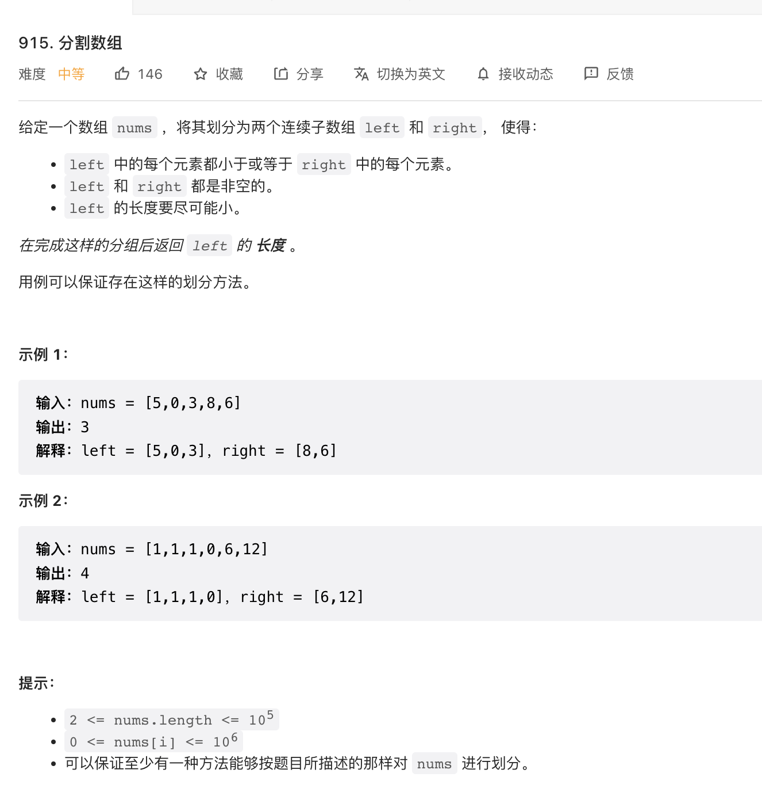

给定一个数组 nums ，将其划分为两个连续子数组 left 和 right， 使得：

left 中的每个元素都小于或等于 right 中的每个元素。
left 和 right 都是非空的。
left 的长度要尽可能小。
在完成这样的分组后返回 left 的 长度 。

用例可以保证存在这样的划分方法。

来源：力扣（LeetCode）
链接：<https://leetcode.cn/problems/partition-array-into-disjoint-intervals>
著作权归领扣网络所有。商业转载请联系官方授权，非商业转载请注明出处。

