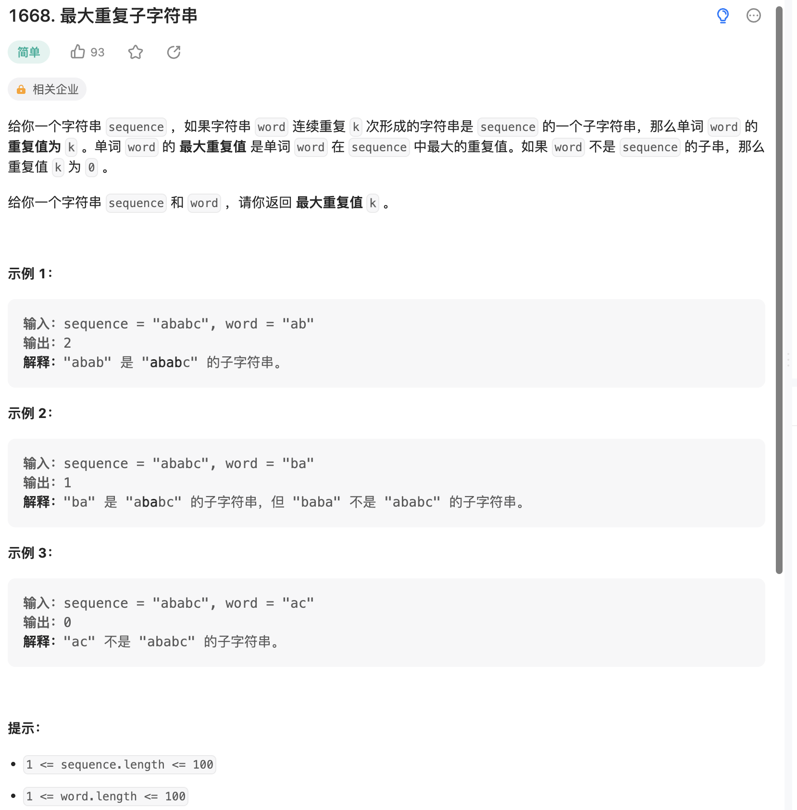

给你一个字符串 sequence ，如果字符串 word 连续重复 k 次形成的字符串是 sequence 的一个子字符串，那么单词 word 的 重复值为 k 。单词 word 的 最大重复值 是单词 word 在 sequence 中最大的重复值。如果 word 不是 sequence 的子串，那么重复值 k 为 0 。

给你一个字符串 sequence 和 word ，请你返回 最大重复值 k 。

来源：力扣（LeetCode）
链接：<https://leetcode.cn/problems/maximum-repeating-substring/>
著作权归领扣网络所有。商业转载请联系官方授权，非商业转载请注明出处。

