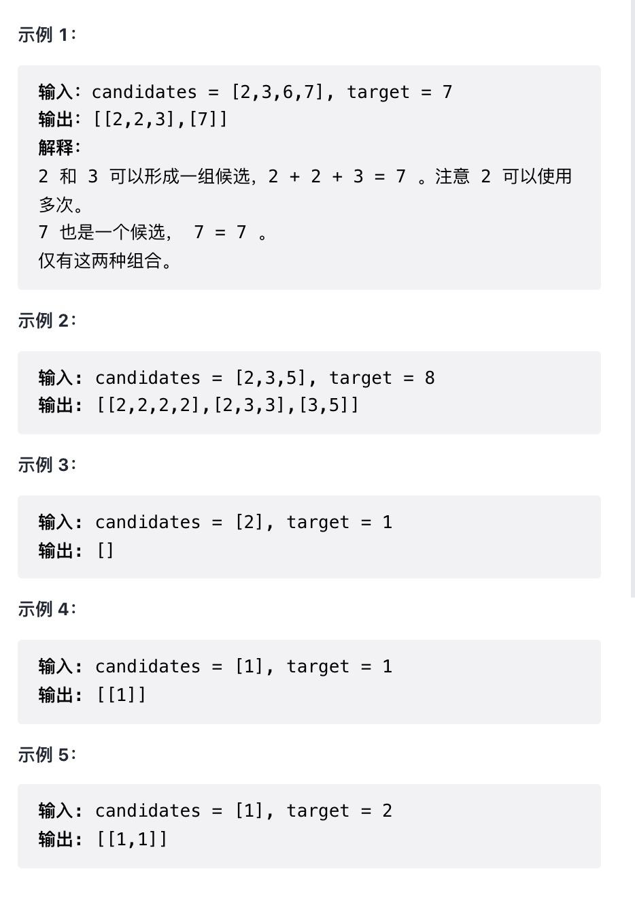

给你一个 _无重复元素_ 的整数数组  candidates 和一个目标整数  target ，找出  candidates  中可以使数字和为目标数  target 的 所有不同组合 ，并以列表形式返回。你可以按 任意顺序 返回这些组合。

candidates 中的 同一个 数字可以 无限制重复被选取 。如果至少一个数字的被选数量不同，则两种组合是不同的。

对于给定的输入，保证和为  target 的不同组合数少于 150 个。

提示：

`1 <= candidates.length <= 30`

`1 <= candidates[i] <= 200`

`candidate 中的每个元素都 互不相同`

`1 <= target <= 500`

来源：力扣（LeetCode）
链接：<https://leetcode-cn.com/problems/combination-sum>
著作权归领扣网络所有。商业转载请联系官方授权，非商业转载请注明出处。

