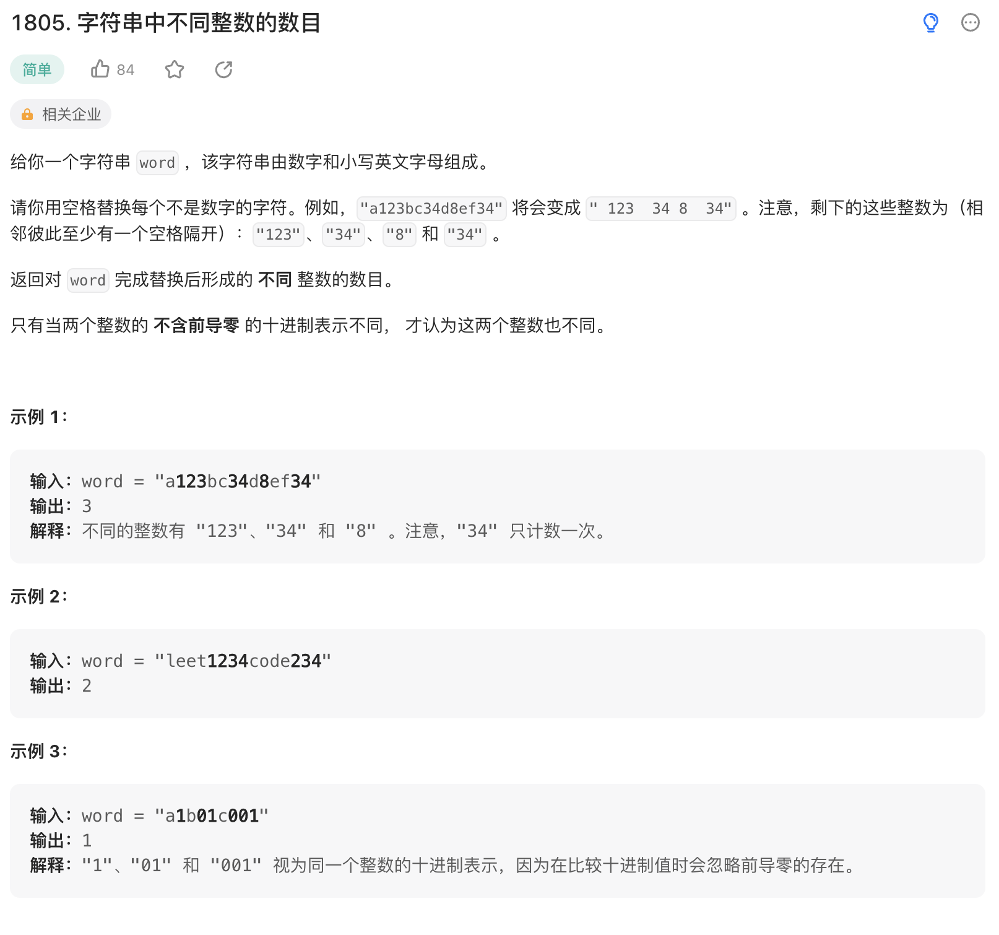

给你一个字符串 word ，该字符串由数字和小写英文字母组成。

请你用空格替换每个不是数字的字符。例如，"a123bc34d8ef34" 将会变成 " 123  34 8  34" 。注意，剩下的这些整数为（相邻彼此至少有一个空格隔开）："123"、"34"、"8" 和 "34" 。

返回对 word 完成替换后形成的 不同 整数的数目。

只有当两个整数的 不含前导零 的十进制表示不同， 才认为这两个整数也不同。

来源：力扣（LeetCode）
链接： <https://leetcode.cn/problems/number-of-different-integers-in-a-string/>
著作权归领扣网络所有。商业转载请联系官方授权，非商业转载请注明出处。

