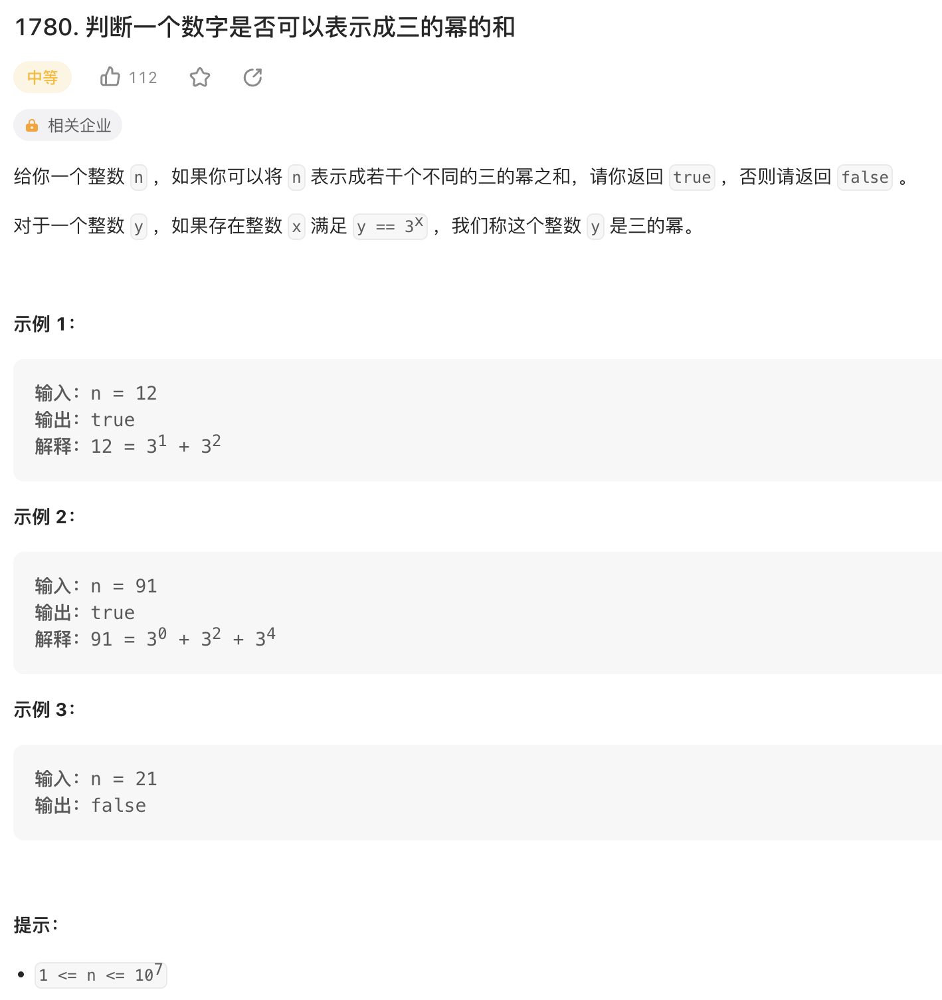

给你一个整数 n ，如果你可以将 n 表示成若干个不同的三的幂之和，请你返回 true ，否则请返回 false 。

对于一个整数 y ，如果存在整数 x 满足 y == 3x ，我们称这个整数 y 是三的幂。

来源：力扣（LeetCode）
链接：<https://leetcode.cn/problems/check-if-number-is-a-sum-of-powers-of-three/>
著作权归领扣网络所有。商业转载请联系官方授权，非商业转载请注明出处。

