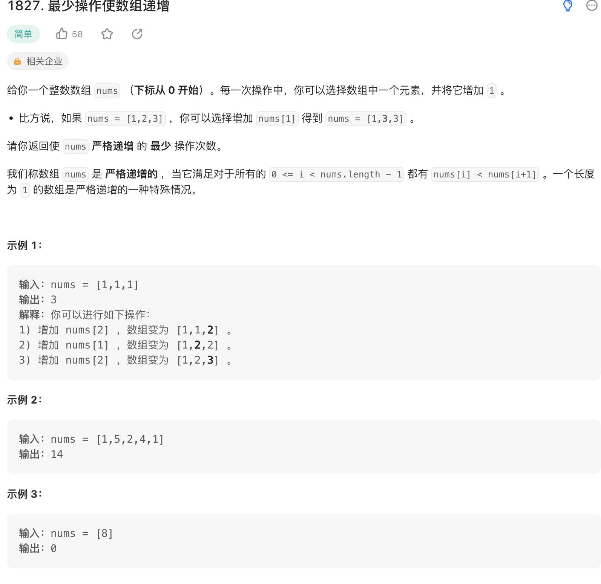

给你一个整数数组 nums （下标从 0 开始）。每一次操作中，你可以选择数组中一个元素，并将它增加 1 。

比方说，如果 nums = [1,2,3] ，你可以选择增加 nums[1] 得到 nums = [1,3,3] 。
请你返回使 nums 严格递增 的 最少 操作次数。

我们称数组 nums 是 严格递增的 ，当它满足对于所有的 0 <= i < nums.length - 1 都有 nums[i] < nums[i+1] 。一个长度为 1 的数组是严格递增的一种特殊情况。

来源：力扣（LeetCode）
链接：<https://leetcode.cn/problems/minimum-operations-to-make-the-array-increasing/>
著作权归领扣网络所有。商业转载请联系官方授权，非商业转载请注明出处。

