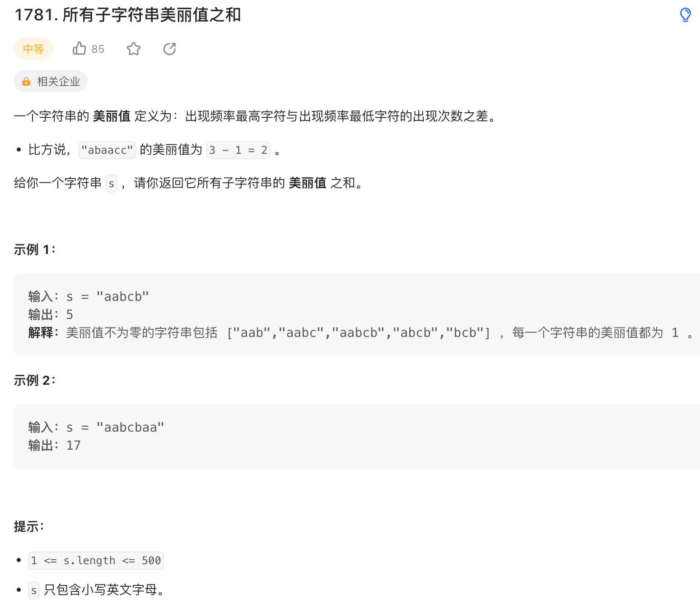

一个字符串的 美丽值 定义为：出现频率最高字符与出现频率最低字符的出现次数之差。

比方说，"abaacc" 的美丽值为 3 - 1 = 2 。
给你一个字符串 s ，请你返回它所有子字符串的 美丽值 之和。

来源：力扣（LeetCode）
链接：<https://leetcode.cn/problems/sum-of-beauty-of-all-substrings/>
著作权归领扣网络所有。商业转载请联系官方授权，非商业转载请注明出处。

