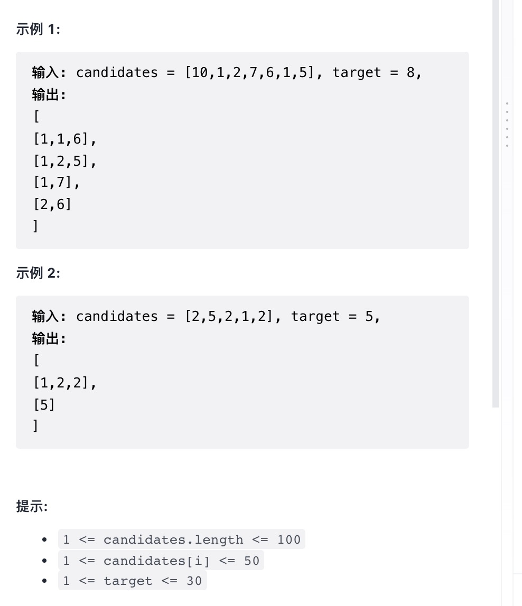

给你一个由候选元素组成的集合 candidates  和一个目标数  target ，找出  candidates  中所有可以使数字和为  target  的组合。

candidates 中的每个元素在每个组合中只能使用 一次 。

注意：解集不能包含重复的组合。

提示：

`1 <= candidates.length <= 100`

`1 <= candidates[i] <= 50`

`1 <= target <= 30`

来源：力扣（LeetCode）
链接：<https://leetcode-cn.com/problems/combination-sum-ii>
著作权归领扣网络所有。商业转载请联系官方授权，非商业转载请注明出处。

