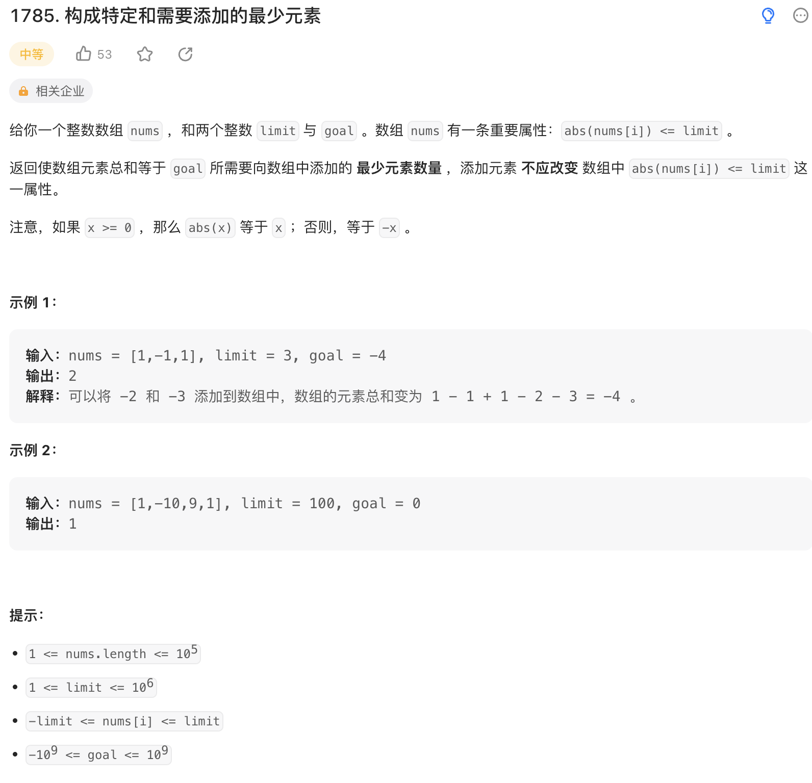

给你一个整数数组 nums ，和两个整数 limit 与 goal 。数组 nums 有一条重要属性：abs(nums[i]) <= limit 。

返回使数组元素总和等于 goal 所需要向数组中添加的 最少元素数量 ，添加元素 不应改变 数组中 abs(nums[i]) <= limit 这一属性。

注意，如果 x >= 0 ，那么 abs(x) 等于 x ；否则，等于 -x 。

来源：力扣（LeetCode）
链接：<https://leetcode.cn/problems/minimum-elements-to-add-to-form-a-given-sum/>
著作权归领扣网络所有。商业转载请联系官方授权，非商业转载请注明出处。

