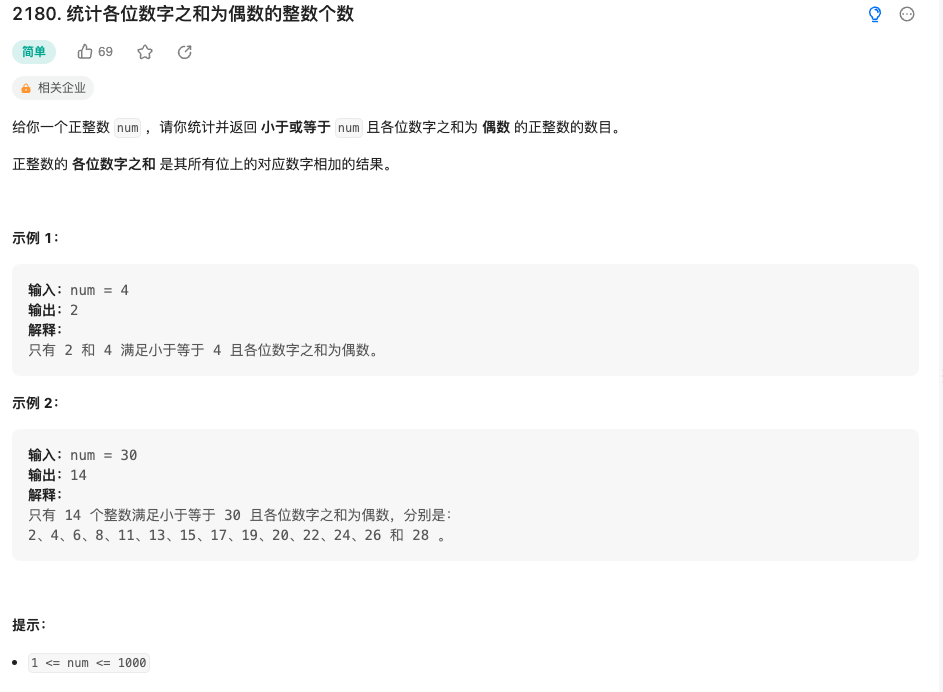

给你一个正整数 num ，请你统计并返回 小于或等于 num 且各位数字之和为 偶数 的正整数的数目。

正整数的 各位数字之和 是其所有位上的对应数字相加的结果。

来源：力扣（LeetCode）
链接：<https://leetcode.cn/problems/count-integers-with-even-digit-sum/>
著作权归领扣网络所有。商业转载请联系官方授权，非商业转载请注明出处。

