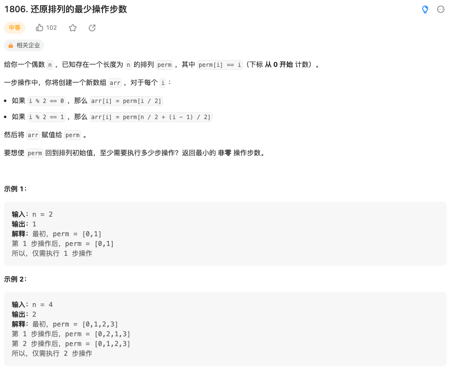

给你一个偶数 n​​​​​​ ，已知存在一个长度为 n 的排列 perm ，其中 perm[i] == i​（下标 从 0 开始 计数）。

一步操作中，你将创建一个新数组 arr ，对于每个 i ：

如果 i % 2 == 0 ，那么 arr[i] = perm[i / 2]
如果 i % 2 == 1 ，那么 arr[i] = perm[n / 2 + (i - 1) / 2]
然后将 arr​​ 赋值​​给 perm 。

要想使 perm 回到排列初始值，至少需要执行多少步操作？返回最小的 非零 操作步数。

来源：力扣（LeetCode）
链接：<https://leetcode.cn/problems/minimum-number-of-operations-to-reinitialize-a-permutation/>
著作权归领扣网络所有。商业转载请联系官方授权，非商业转载请注明出处。

