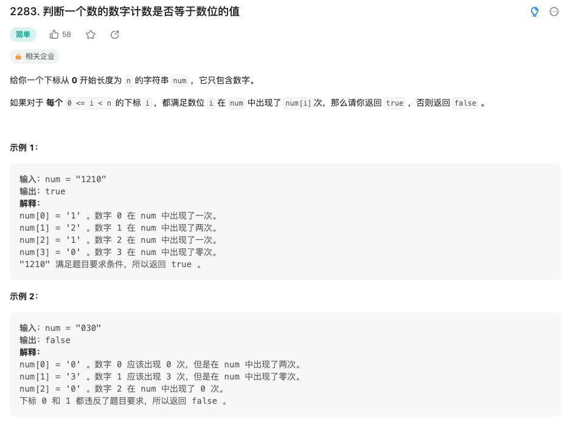

给你一个下标从 0 开始长度为 n 的字符串 num ，它只包含数字。

如果对于 每个 0 <= i < n 的下标 i ，都满足数位 i 在 num 中出现了 num[i]次，那么请你返回 true ，否则返回 false 。

来源：力扣（LeetCode）
链接：<https://leetcode.cn/problems/check-if-number-has-equal-digit-count-and-digit-value/>
著作权归领扣网络所有。商业转载请联系官方授权，非商业转载请注明出处。

