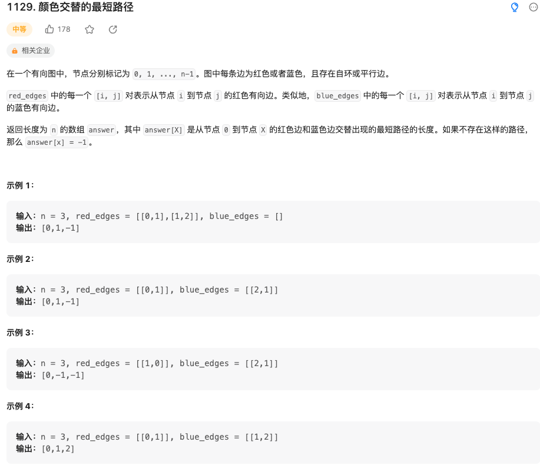

在一个有向图中，节点分别标记为 0, 1, ..., n-1。图中每条边为红色或者蓝色，且存在自环或平行边。

red_edges 中的每一个 [i, j] 对表示从节点 i 到节点 j 的红色有向边。类似地，blue_edges 中的每一个 [i, j] 对表示从节点 i 到节点 j 的蓝色有向边。

返回长度为 n 的数组 answer，其中 answer[X] 是从节点 0 到节点 X 的红色边和蓝色边交替出现的最短路径的长度。如果不存在这样的路径，那么 answer[x] = -1。

来源：力扣（LeetCode）
链接：https://leetcode.cn/problems/shortest-path-with-alternating-colors/
著作权归领扣网络所有。商业转载请联系官方授权，非商业转载请注明出处。

