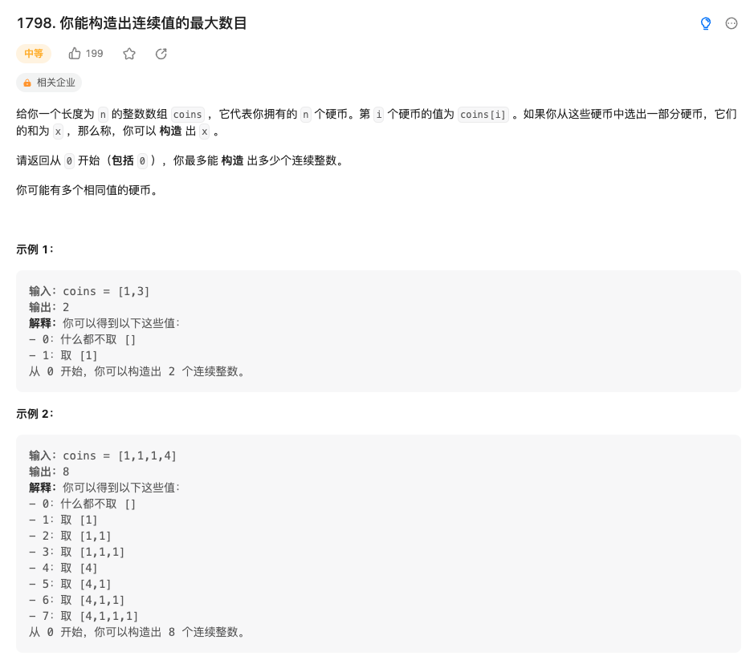

给你一个长度为 n 的整数数组 coins ，它代表你拥有的 n 个硬币。第 i 个硬币的值为 coins[i] 。如果你从这些硬币中选出一部分硬币，它们的和为 x ，那么称，你可以 构造 出 x 。

请返回从 0 开始（包括 0 ），你最多能 构造 出多少个连续整数。

你可能有多个相同值的硬币。

来源：力扣（LeetCode）
链接：<https://leetcode.cn/problems/maximum-number-of-consecutive-values-you-can-make/>
著作权归领扣网络所有。商业转载请联系官方授权，非商业转载请注明出处。

