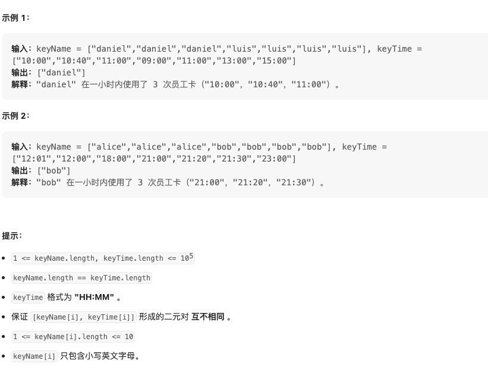

力扣公司的员工都使用员工卡来开办公室的门。每当一个员工使用一次他的员工卡，安保系统会记录下员工的名字和使用时间。如果一个员工在一小时时间内使用员工卡的次数大于等于三次，这个系统会自动发布一个 警告 。

给你字符串数组 keyName 和 keyTime ，其中 [keyName[i], keyTime[i]] 对应一个人的名字和他在 某一天 内使用员工卡的时间。

使用时间的格式是 24小时制 ，形如 "HH:MM" ，比方说 "23:51" 和 "09:49" 。

请你返回去重后的收到系统警告的员工名字，将它们按 字典序升序 排序后返回。

请注意 "10:00" - "11:00" 视为一个小时时间范围内，而 "22:51" - "23:52" 不被视为一小时时间范围内。

来源：力扣（LeetCode）
链接：<https://leetcode.cn/problems/alert-using-same-key-card-three-or-more-times-in-a-one-hour-period/>
著作权归领扣网络所有。商业转载请联系官方授权，非商业转载请注明出处。

