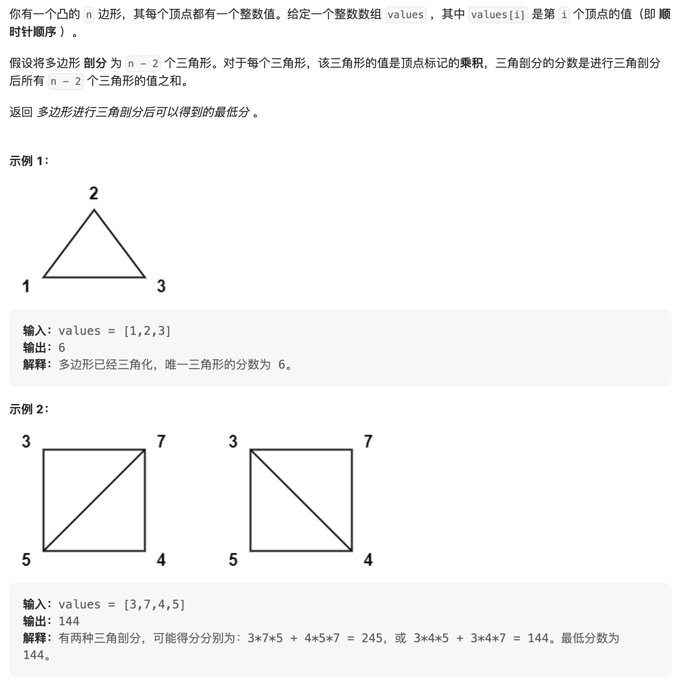

你有一个凸的 n 边形，其每个顶点都有一个整数值。给定一个整数数组 values ，其中 values[i] 是第 i 个顶点的值（即 顺时针顺序 ）。

假设将多边形 剖分 为 n - 2 个三角形。对于每个三角形，该三角形的值是顶点标记的乘积，三角剖分的分数是进行三角剖分后所有 n - 2 个三角形的值之和。

返回 多边形进行三角剖分后可以得到的最低分 。

来源：力扣（LeetCode）
链接：<https://leetcode.cn/problems/minimum-score-triangulation-of-polygon/>
著作权归领扣网络所有。商业转载请联系官方授权，非商业转载请注明出处。

