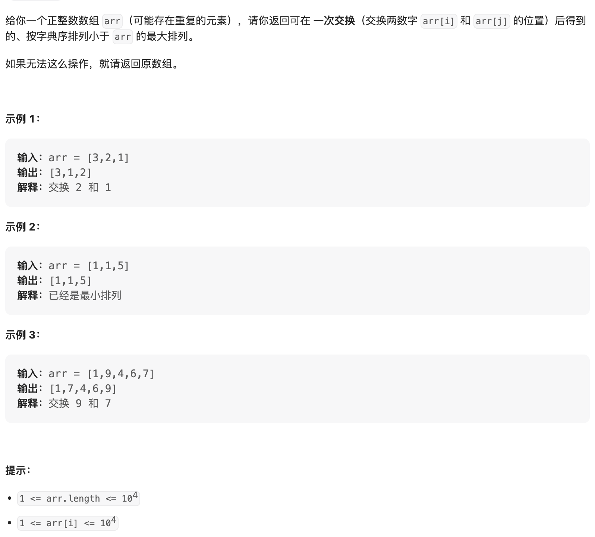

给你一个正整数数组 arr（可能存在重复的元素），请你返回可在 一次交换（交换两数字 arr[i] 和 arr[j] 的位置）后得到的、按字典序排列小于 arr 的最大排列。

如果无法这么操作，就请返回原数组。

来源：力扣（LeetCode）
链接：<https://leetcode.cn/problems/previous-permutation-with-one-swap/>
著作权归领扣网络所有。商业转载请联系官方授权，非商业转载请注明出处。

